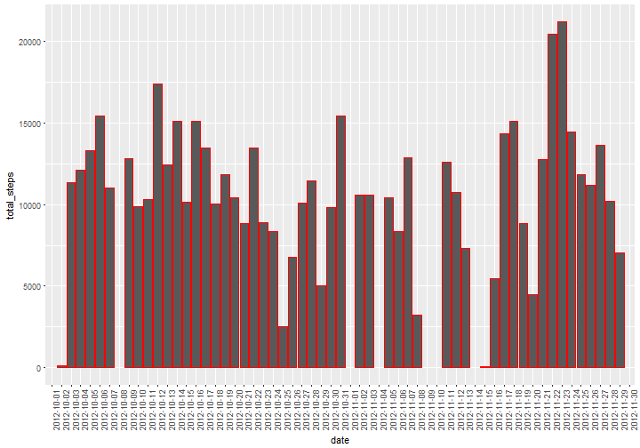
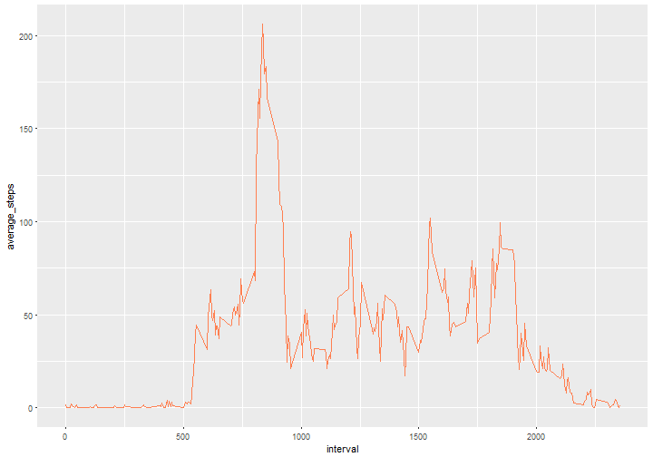
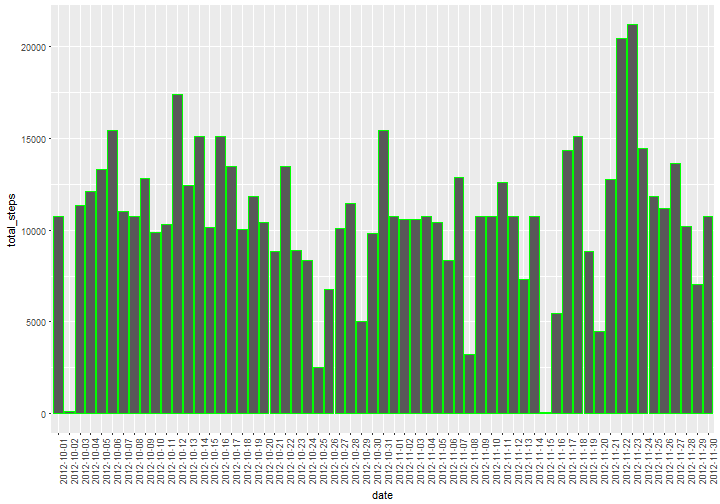
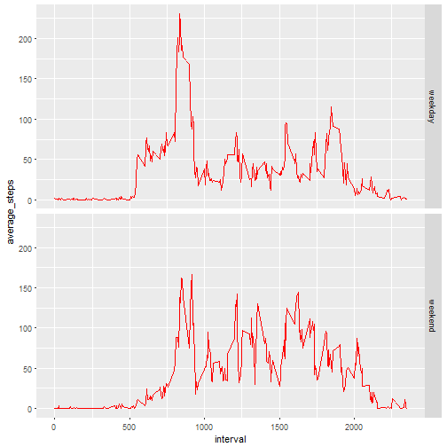

```r
---
title: "Reproducible Research: Peer Assessment 1"
output: html_document
keep_md: true
---


## Loading and preprocessing the data
```

```
## Error: <text>:9:0: unexpected end of input
## 7: 
## 8: ## Loading and preprocessing the data
##   ^
```

```r
library(dplyr)
library(ggplot2)

unzip("activity.zip")
activity <- read.csv("activity.csv", stringsAsFactors = F)
activity <- tbl_df(activity)
```


## What is mean total number of steps taken per day?
1. Calculating the total number of steps taken per day

```r
total_day <- activity %>% group_by(date) %>% summarize(total_steps = sum(steps))
```
2. Making a histogram of the total number of steps taken each day

```r
ggplot(total_day, aes(date, total_steps)) + geom_bar(stat = "identity", col = "red") + theme(axis.text.x = element_text(angle = 90, hjust = 1))
```

```
## Warning: Removed 8 rows containing missing values (position_stack).
```


3. Calculating mean and median of the total number of steps taken per day

```r
mean(total_day$total_steps, na.rm = T)
```

```
## [1] 10766.19
```

```r
median(total_day$total_steps, na.rm = T)
```

```
## [1] 10765
```
## What is the average daily activity pattern?
1. Make a time series plot (i.e. type = "l") of the 5-minute interval (x-axis) and the average number of steps taken, averaged across all days (y-axis)

```r
mean.steps <- activity %>% filter(!is.na(steps)) %>% group_by(interval) %>% summarize(average_steps = mean(steps))
ggplot(mean.steps, aes(x = interval, y = average_steps)) + geom_line(col = "coral")
```


2. Which 5-minute interval, on average across all the days in the dataset, contains the maximum number of steps?

```r
max.interval <- mean.steps %>% filter(average_steps == max(average_steps)) %>% print
```

```
## # A tibble: 1 × 2
##   interval average_steps
##      <int>         <dbl>
## 1      835      206.1698
```


## Imputing missing values
1. Calculate and report the total number of missing values in the dataset (i.e. the total number of rows with NAs)

```r
nrow(activity[is.na(activity$steps),])
```

```
## [1] 2304
```

2. Devise a strategy for filling in all of the missing values in the dataset. The strategy does not need to be sophisticated. For example, you could use the mean/median for that day, or the mean for that 5-minute interval, etc.
I will use the mean for 5-minute interval as fillers for missing values

3. Create a new dataset that is equal to the original dataset but with the missing data filled in.

```r
mean.steps <- activity %>% filter(!is.na(steps)) %>% group_by(interval) %>% summarize(average_steps = mean(steps))
activity.filled <- activity %>% 
        left_join(mean.steps, by = "interval") %>% 
        mutate(steps = ifelse(is.na(steps), average_steps, steps)) %>%
        select(-average_steps) 
```
4. Make a histogram of the total number of steps taken each day and Calculate and report the mean and median total number of steps taken per day. Do these values differ from the estimates from the first part of the assignment? What is the impact of imputing missing data on the estimates of the total daily number of steps

```r
total_day_filled <- activity.filled %>% group_by(date) %>% summarize(total_steps = sum(steps))
```

```r
ggplot(total_day_filled, aes(date, total_steps)) + geom_bar(stat = "identity", col = "green") + theme(axis.text.x = element_text(angle = 90, hjust = 1))
```



```r
mean(total_day_filled$total_steps)
```

```
## [1] 10766.19
```

```r
median(total_day_filled$total_steps)
```

```
## [1] 10766.19
```
The **mean** value is the same as the value before imputing missing data because we put the mean value for that particular 5-min interval. The **median** value shows a little difference : but it depends on where the missing values are.


## Are there differences in activity patterns between weekdays and weekends?
1. Create a new factor variable in the dataset with two levels -- "weekday" and "weekend" indicating whether a given date is a weekday or weekend day.

```r
activity.filled$date <- as.Date(activity.filled$date)
activity.filled$week <- as.factor(ifelse(weekdays(activity.filled$date) %in% c("Saturday", "Sunday"), "weekend", "weekday"))
```
2. Make a panel plot containing a time series plot (i.e. type = "l") of the 5-minute interval (x-axis) and the average number of steps taken, averaged across all weekday days or weekend days (y-axis).

```r
mean.steps <- activity.filled %>% group_by(interval, week) %>% summarize(average_steps = mean(steps))
ggplot(mean.steps, aes(x = interval, y = average_steps)) + geom_line(col = "red") + facet_grid(week ~ .)
```


```

